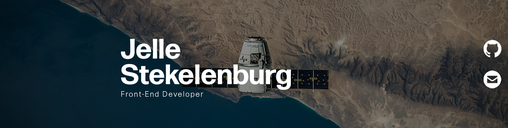
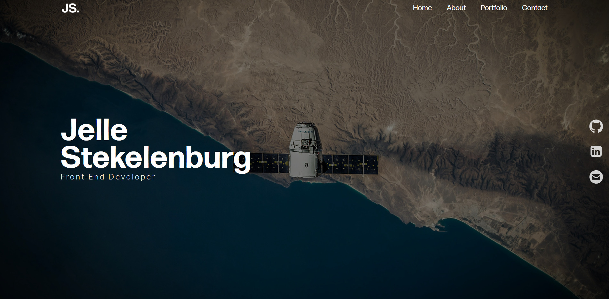

# New portfolio: Jelle Stekelenburg

I'm working on my new portfolio for my next internship.
Its main use is to show off my work, may this be school related or not.

### Devlog
#### Week 1 
Deze week ben ik begonnen aan mijn nieuwe portfolio, in de eerste week ben ik begonnen met de landing header.
De header is het visitekaartje van heel de website, en het is belangrijk om deze zo veel mogelijk informatie te geven en toch clean te houden. Dit heb ik geprobeerd.

Deze week gedaan
* Laravel geinstalleerd
* Paths gefixt
* Includes aangemaakt
* Header gemaakt
* Navigatie gemaakt
* Socialmedia/info aan de rechter kant van de header gemaakt
* Animaties gemaakt

