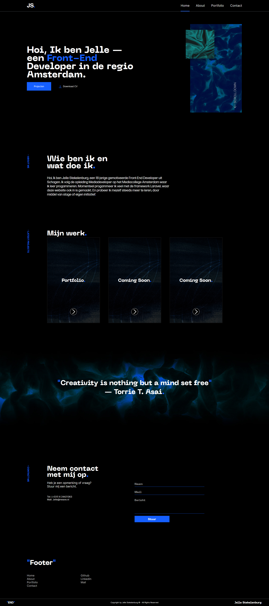

# New portfolio: Jelle Stekelenburg

Ik ben aan het werk met mijn nieuwe portfolio,
Dit portfolio word gebruikt om mijn werk te laten zien.

### Devlog
#### Week 1 
Deze week ben ik begonnen aan mijn nieuwe portfolio, in de eerste week ben ik begonnen met de landing header.
De header is het visitekaartje van heel de website, en het is belangrijk om deze zo veel mogelijk informatie te geven en toch clean te houden. Dit heb ik geprobeerd.

Deze week gedaan:
* Laravel geinstalleerd
* Paths gefixt
* Includes aangemaakt
* Header gemaakt
* Navigatie gemaakt
* Socialmedia/info aan de rechter kant van de header gemaakt
* Animaties gemaakt

#### Week 2
Deze week ben ik een design tegen gekomen van een website waar ik erg door ben geïnspireerd. Ik heb aan de hand van het design de landing header aangepast en ben zo verder gegaan aan andere dingen. De hele week ben ik bezig geweest met de volledige index van de website. Ik ben tot nu toe klaar met alles behalve de footer en het responsive maken, de footer moet nog helemaal gemaakt worden, alleen ben ik er nog niet uit hoe die er precies uit moet komen te zien. En qua responsive maken moet ik nog de nav en footer plus een paar kleine dingen.

Ik heb meer willen doen, maar helaas moet ik ook aan stage en school.
Dit zou in de vakantie veranderen.

Deze week gedaan:
* Design van landing header aangepast
* Nieuwe sass files gemaakt (nav, footer, pages)
* Moodbord gemaakt voor de kleuren die ik gebruik (*Hieronder een is een link te vinden*)
* Nieuw font toegevoegd genaamt: Neue Machina
* Landing header foto veranderd naar iets met meer style
* Index geüpdate
    * About aangemaakt en gestyled
    * Projecten (portfolio) aangemaakt en gestyled
    * Contact aangemaakt en gestyled
* Nieuwe pagina's aangemaakt en in routes gezet
    * /About
    * /Portfolio
    * /Contact

    

Resultaat tot nu toe:

Bestanden:
- [Styleboard voor kleuren](https://xd.adobe.com/view/af63fad7-4372-4584-4e50-7731fd0b9444-d952/)

> 14/06/2020 20:59

